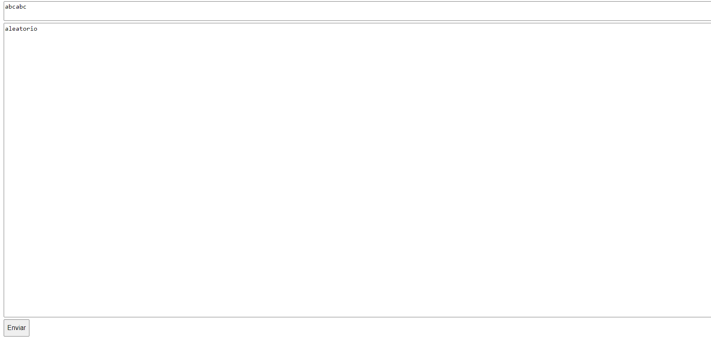
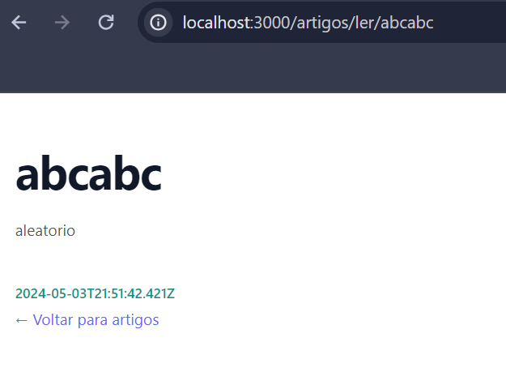

# Projeto 1 - Backend

Este projeto, desenvolvido pelo Grupo 8 na disciplina de Programação Web Back-End é um CMS simplificado desenvolvido para permitir a criação, edição e exclusão de páginas web, além de um sistema básico de login para administradores de conteúdo.


# Funcionalidades


Sistema de Login: Permite que administradores de conteúdo façam login para acessar as funcionalidades de criação, edição e exclusão de páginas.

Criação Dinâmica de Páginas: Usuários logados podem criar novas páginas, especificando a URL e o conteúdo desejado, podendo incluir tags  HTML.

Edição do Conteúdo: Administradores podem editar o conteúdo de uma página, mantendo a URL original.

Exclusão de Páginas: Permite que administradores  excluam páginas.

Página Inicial do Site: Exibe uma lista de todas as páginas criadas 

Visualizador de Páginas: Permite visualizar o conteúdo das páginas a partir das URLs definidas durante a criação.

# Tecnologias Utilizadas
 - Node.JS
 - Express.JS
 - Joi
 - Mustache 
 - HTML, CSS e JS
 - Tailwind.css etc..
 

# Repositório do Projeto
```bash
https://github.com/JoaoClaudioSilva/projeto-backend
``` 


# Funcionamento
Após o usuário fazer login corretamente, ele será redirecionado para a página principal. Na página principal, ele existirá um botão + que é responsável pela criação de uma página.

 </img>

Ao clicar no botão, o usuário será redirecionado para um formulário onde poderá preencher o título (endpoint) e seu conteúdo podendo ser em HTML.

 </img>

Após preencher o formulário e enviar. Em seguida, será redirecionado de volta para a página principal, onde verá a lista de paginas que foram criadas.

 </img>

Ao clicar em uma das paginas listadas, o usuário será redirecionado para a página que foi criada.

 </img>

# Instalação

```bash
git clone https://github.com/JoaoClaudioSilva/projeto-backend
``` 
Após clonar o repositório, navegue até o diretório do projeto e execute o comando abaixo para instalar as dependências necessárias

```bash
npm install
``` 
Agora é so iniciar o projeto com o comando abaixo
```bash
npm start
``` 